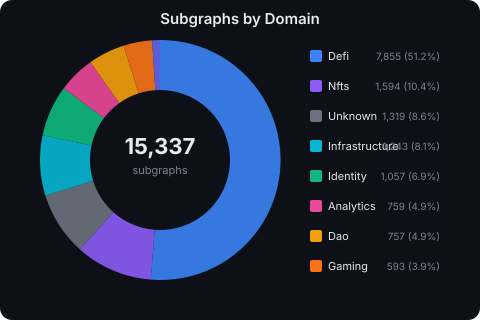
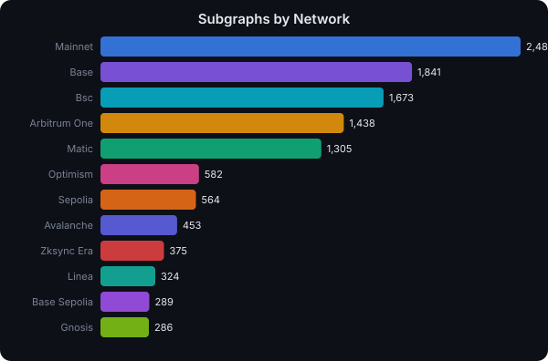
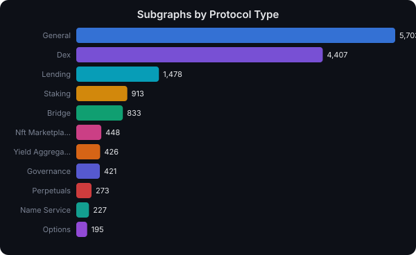
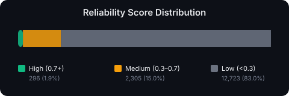

# Subgraph Registry

<a href="https://glama.ai/mcp/servers/PaulieB14/subgraph-registry">
  
</a>

Agent-friendly semantic classification of all subgraphs on [The Graph Network](https://thegraph.com).

Pre-computed index of **14,700+ subgraphs** with domain classification, protocol type detection, schema fingerprinting, canonical entity mapping, and composite reliability scoring.

## The Problem

Agents querying The Graph need to discover and select the right subgraph before they can query data. Today this requires 3-4 tool calls (search, check volumes, fetch schema, infer structure) before any real work happens. This registry flips that: agents start with structured knowledge, not a blank slate.

## What It Does

1. **Crawls** all active subgraphs from the Graph Network meta-subgraph
2. **Fetches** the GraphQL schema for every deployment
3. **Classifies** each subgraph by domain, protocol type, canonical entities, and schema family
4. **Scores** reliability using on-chain signals (query fees, volume, curation, stake)
5. **Publishes** as SQLite database + REST API + MCP server
6. **Generates** visual dashboards and bot-readable category files (auto-updated with each sync)

---

## Registry at a Glance

<p align="center">
  
</p>

<p align="center">
  
</p>

<p align="center">
  
</p>

<p align="center">
  
</p>

> Charts auto-generated from `registry.db` on each sync. See [`python/generate_docs.py`](python/generate_docs.py).

---

## Browse by Category

### Domains

Explore subgraphs by use case — each file lists the top 25 subgraphs ranked by reliability score.

| Domain | Count | File |
|--------|-------|------|
| [DeFi](docs/domains/defi.md) | 11,218 | Swaps, pools, lending, vaults, yield |
| [NFTs](docs/domains/nfts.md) | 857 | Collections, marketplaces, sales |
| [Infrastructure](docs/domains/infrastructure.md) | 581 | Indexers, oracles, registries |
| [DAO](docs/domains/dao.md) | 429 | Governance, proposals, voting |
| [Identity](docs/domains/identity.md) | 401 | ENS, name services, resolvers |
| [Analytics](docs/domains/analytics.md) | 327 | Snapshots, metrics, historical data |
| [Gaming](docs/domains/gaming.md) | 247 | Players, quests, items, worlds |
| [Social](docs/domains/social.md) | 74 | Profiles, posts, follows |

Full index: [`docs/DOMAINS.md`](docs/DOMAINS.md)

### Networks

Explore subgraphs by blockchain — each file lists the top 25 subgraphs on that chain.

| Network | Count | File |
|---------|-------|------|
| [Ethereum](docs/networks/mainnet.md) | 2,377 | Largest ecosystem |
| [Base](docs/networks/base.md) | 1,728 | Fast-growing L2 |
| [BSC](docs/networks/bsc.md) | 1,582 | BNB Chain |
| [Arbitrum](docs/networks/arbitrum-one.md) | 1,376 | Leading L2 |
| [Polygon](docs/networks/matic.md) | 1,266 | Polygon PoS |
| [Optimism](docs/networks/optimism.md) | 568 | OP Stack L2 |
| [Avalanche](docs/networks/avalanche.md) | 440 | C-Chain |

Full index: [`docs/NETWORKS.md`](docs/NETWORKS.md)

### Protocol Types

| Type | Count | Description |
|------|-------|-------------|
| DEX | 4,176 | Uniswap, Sushi, Curve, Balancer, PancakeSwap |
| Lending | 1,424 | Aave, Compound, Morpho, Spark, Silo |
| Staking | 867 | Lido, Rocket Pool, EigenLayer, Graph Network |
| Bridge | 771 | Hop, Stargate, Across, Wormhole, LayerZero |
| NFT Marketplace | 436 | OpenSea, Blur, Rarible, Foundation |
| Governance | 416 | Snapshot, Tally, Compound Governor |
| Yield Aggregator | 387 | Yearn, Beefy, Harvest, Convex |
| Perpetuals | 266 | GMX, Gains, dYdX, Hyperliquid |
| Name Service | 223 | ENS, Space ID, Unstoppable Domains |
| Options | 179 | Premia, Dopex, Lyra, Hegic |

---

## Reliability Score

Each subgraph gets a composite reliability score (0-1) based on four on-chain signals:

| Signal | Weight | What it measures |
|--------|--------|------------------|
| **Query Fees** | 30% | GRT fees earned from actual usage |
| **Query Volume** | 30% | 30-day query count |
| **Curation Signal** | 20% | GRT tokens curated by the community |
| **Indexer Allocation** | 20% | GRT allocated to this subgraph by indexers |

All values are log-scaled and capped at 1.0. A 0.5 penalty is applied if the subgraph has been denied/deprecated.

**Score tiers:** High (0.7+) = strong signal, real usage | Medium (0.3-0.7) = functional, some activity | Low (<0.3) = minimal signal or test deployment

---

## MCP Server

The registry is available as an MCP server with **dual transport** — stdio for local clients and SSE/HTTP for remote agents.

> The shipped server is the Node implementation in [`src/index.js`](src/index.js); that's what `npx subgraph-registry-mcp` runs and what's published to npm. A Python equivalent in [`python/mcp_server.py`](python/mcp_server.py) is kept for local development against the same SQLite database — bug fixes and new tools should land in the Node version first.

**4 tools:**
- **search_subgraphs** — filter by domain, network, protocol type, entity, or keyword
- **recommend_subgraph** — natural language goal to best subgraphs
- **get_subgraph_detail** — full classification for a specific subgraph
- **list_registry_stats** — registry overview (domains, networks, counts)

### Install

```bash
# Claude Code
claude mcp add subgraph-registry -- npx subgraph-registry-mcp

# Claude Desktop
{
  "mcpServers": {
    "subgraph-registry": {
      "command": "npx",
      "args": ["subgraph-registry-mcp"]
    }
  }
}

# Remote agents (SSE)
npx subgraph-registry-mcp --http-only
# Then connect to http://localhost:3848/sse
```

The server auto-downloads the pre-built registry (8MB SQLite) from GitHub on first run.

---

## REST API

```
GET /summary                    Registry overview and stats
GET /domains                    Domain breakdown
GET /networks                   Network breakdown
GET /families                   Schema family groups (fork/clone detection)
GET /subgraphs                  Filter subgraphs
GET /subgraphs/{id}             Full detail for one subgraph
GET /search?q=uniswap           Free-text search
GET /recommend?goal=...&chain=  Agent-optimized recommendation
```

```bash
# Start API server
cd python && python server.py

# Example: find DEX subgraphs on Arbitrum
curl "http://localhost:3847/recommend?goal=query+DEX+trades+on+Arbitrum&chain=arbitrum-one"

# Example: filter by entity type
curl "http://localhost:3847/subgraphs?entity=liquidity_pool&network=base&min_reliability=0.5"
```

---

## Bot-Readable Category Files

The `docs/` directory contains structured `.md` files with YAML frontmatter designed for AI agents and bots to consume:

```
docs/
├── DOMAINS.md           # Index of all domains with counts
├── NETWORKS.md          # Index of all networks with counts
├── charts/              # Auto-generated SVG visualizations
│   ├── domains.svg
│   ├── networks.svg
│   ├── protocol-types.svg
│   └── reliability.svg
├── domains/             # One file per domain
│   ├── defi.md          # Top 25 DeFi subgraphs by reliability
│   ├── nfts.md
│   ├── dao.md
│   └── ...
└── networks/            # One file per network
    ├── mainnet.md       # Top 25 Ethereum subgraphs by reliability
    ├── base.md
    ├── arbitrum-one.md
    └── ...
```

Each category file includes:
- YAML frontmatter (domain/network, count, percentage, last updated)
- Top 25 subgraphs ranked by reliability score
- MCP tool and REST API query examples

---

## Architecture

```
Graph Network Subgraph (meta-subgraph, 140M queries/month)
    |
    v
crawler.py ---- async httpx, ID-based cursor pagination
    |
    v
classifier.py - rule-based domain/protocol classification + schema fingerprinting
    |
    v
registry.py --- builds SQLite + indices
    |
    ├── server.py ------ FastAPI REST API (:3847)
    ├── generate_docs.py SVG charts + category .md files
    └── scheduler.py --- weekly incremental sync

MCP Server (src/index.js, published to npm)
    ├── stdio   ←── Claude Desktop / Claude Code
    └── SSE     ←── OpenClaw / remote agents (:3848)

python/mcp_server.py — local-dev MCP server hitting the same SQLite DB
```

## Quick Start (Local Build)

```bash
cd python
python3 -m venv .venv && source .venv/bin/activate
pip install -r requirements.txt

echo "GATEWAY_API_KEY=your-key-here" > .env

# Full crawl + classify (~11 min)
python registry.py

# Generate charts and category files
python generate_docs.py

# Start API server
python server.py
```

## How It Stays Current

A GitHub Actions workflow runs every 3 days:
1. Incremental crawl (`updatedAt_gte: lastSyncTimestamp`)
2. Reclassify new/changed subgraphs
3. Regenerate SVG charts and category .md files
4. Commit and push updates

## License

MIT
